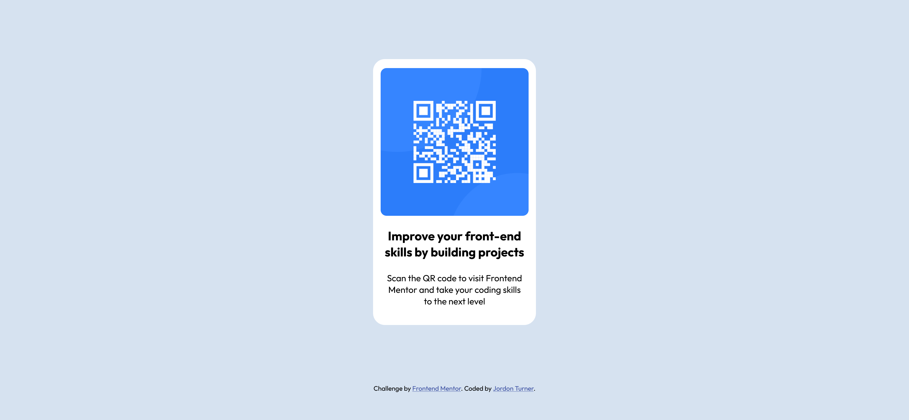

# Frontend Mentor - QR code component solution

This is a solution to the [QR code component challenge on Frontend Mentor](https://www.frontendmentor.io/challenges/qr-code-component-iux_sIO_H). Frontend Mentor challenges help you improve your coding skills by building realistic projects. 

## Table of contents

- [Overview](#overview)
  - [Screenshot](#screenshot)
  - [Links](#links)
- [My process](#my-process)
  - [Built with](#built-with)
  - [Useful resources](#useful-resources)
- [Author](#author)
- [Acknowledgments](#acknowledgments)

## Overview

Hello, Jordon here! 

This is my first project that I've done with FrontEnd Mentor and I'm really happy with the results! It's a simple one but it shows that I've been learning and that's all the motivation I need to keep moving forward. I look forward to looking back at this in 2, 4, 10 years time to see how far I've come.

### Screenshot

### Links

- Solution URL: [Github Repository](https://github.com/JordonTurner/FrontEndMentorQRChallenge)
- Live Site URL: [Add live site URL here](https://your-live-site-url.com)

## My process

I started with doing what I felt was the easier things first and then went on to break down the bigger things. The thing that was the most satisfying was creating the container and actually aligning the QR image properly in it. CSS Positioning is the thing I'm finding the hardest to wrap my head around. I never know which way to tackle them. Flexbox might be my biggest enemy so far. But I figured it out and everything else was simple enough.

### Built with

- Semantic HTML5 markup
- CSS custom properties
- Flexbox

### Useful resources

- [Coder Coder](https://www.youtube.com/@TheCoderCoder) - I want to thank Coder Coder and their Youtube channel for introducing me to FrontEnd Mentor. 

## Author

- Website - [Jordon Turner] (Personal Site Under Construction)
- Frontend Mentor - [@Dasnof](https://www.frontendmentor.io/profile/JordonTurner)

## Acknowledgments

FrontEnd Mentor for providing a valuable service!

